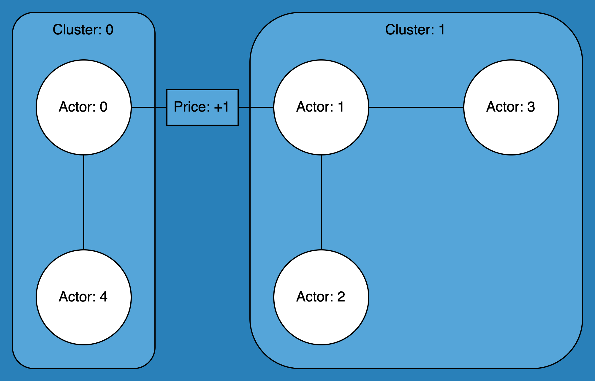

~~~~~~~~~~~~~~~~~~~
Matching Algorithms
~~~~~~~~~~~~~~~~~~~

The core of Simply are the different matching algorithms. They decide which bids and asks are
matched together and at what price. Currently, Simply has three matching algorithms: Pay-as-bid,
Two-Sided Pay-as-clear and BEST matching.

Example Scenario
================

   Figure 1: basic network consisting of 5 actors across 2 clusters.

Order Input
-----------

.. code:: python

    Order = namedtuple("Order", ("type", "time", "actor_id", "cluster", "energy", "price"))

    # Add bids
    m.accept_order(Order(-1, 0, 1, 1, 0.1, 10))
    m.accept_order(Order(-1, 0, 1, 1, 0.1, 7))
    m.accept_order(Order(-1, 0, 0, 0, 0.1, 10))

    # Add asks
    m.accept_order(Order(1, 0, 3, 1, 0.1, 6))
    m.accept_order(Order(1, 0, 3, 1, 0.1, 4))

Pay-as-bid Algorithm
====================

**Final Matches (Output):**

+--------------------------------+-------------------------------+----------------+
| Bids                           | Asks                          | Matched Price  |
+================================+===============================+================+
| actor 0, order_id 2, price 10  | actor 3, order_id 4, price 4  | 10             |
+--------------------------------+-------------------------------+----------------+
| actor 1, order_id 0, price 10  | actor 3, order_id 3, price 6  | 10             |
+--------------------------------+-------------------------------+----------------+
| actor 1, order_id 1, price 7   |                               |                |
+--------------------------------+-------------------------------+----------------+

Two-sided Pay-As-Clear Algorithm
================================

+--------------------------------+-------------------------------+----------------+
| Bids                           | Asks                          | Matched Price  |
+================================+===============================+================+
| actor 1, order_id 0, price 10  | actor 3, order_id 4, price 4  | 6              |
+--------------------------------+-------------------------------+----------------+
| actor 0, order_id 2, price 10  | actor 3, order_id 3, price 6  | 6              |
+--------------------------------+-------------------------------+----------------+
| actor 1, order_id 1, price 7   |                               |                |
+--------------------------------+-------------------------------+----------------+

BEST Matching Algorithm
=======================

Below shows the internal steps when matching the orders from the example scenario using BEST
matching.

**Matching Cluster 0 (Initial Attempt):**

+--------------------------------+-------------------------------+----------------+
| Bids                           | Asks                          | Matched Price  |
+================================+===============================+================+
| actor 0, order_id 2, price 10  | actor 3, order_id 4, price 5  | 5              |
+--------------------------------+-------------------------------+----------------+
|                                | actor 3, order_id 3, price 7  |                |
+--------------------------------+-------------------------------+----------------+

**Matching Cluster 1 (Initial Attempt):**

+--------------------------------+-------------------------------+----------------+
| Bids                           | Asks                          | Matched Price  |
+================================+===============================+================+
| actor 1, order_id 0, price 10  | actor 3, order_id 4, price 4  | 6              |
+--------------------------------+-------------------------------+----------------+
| actor 1, order_id 1, price 7   | actor 3, order_id 3, price 6  | 6              |
+--------------------------------+-------------------------------+----------------+

**Matching Cluster 0 (Rematch Attempt):**

+--------------------------------+-------------------------------+----------------+
| Bids                           | Asks                          | Matched Price  |
+================================+===============================+================+
| actor 0, order_id 2, price 10  | actor 3, order_id 3, price 7  | 7              |
+--------------------------------+-------------------------------+----------------+

**Matching Cluster 1 (Rematch Attempt):**

+--------------------------------+-------------------------------+----------------+
| Bids                           | Asks                          | Matched Price  |
+================================+===============================+================+
| actor 1, order_id 0, price 10  | actor 3, order_id 4, price 4  | 4              |
+--------------------------------+-------------------------------+----------------+
| actor 1, order_id 1, price 7   |                               |                |
+--------------------------------+-------------------------------+----------------+

**Final Matches (Output):**

+--------------------------------+-------------------------------+----------------+
| Bids                           | Asks                          | Matched Price  |
+================================+===============================+================+
| actor 0, order_id 2, price 10  | actor 3, order_id 3, price 7  | 7              |
+--------------------------------+-------------------------------+----------------+
| actor 1, order_id 0, price 10  | actor 3, order_id 4, price 4  | 4              |
+--------------------------------+-------------------------------+----------------+
