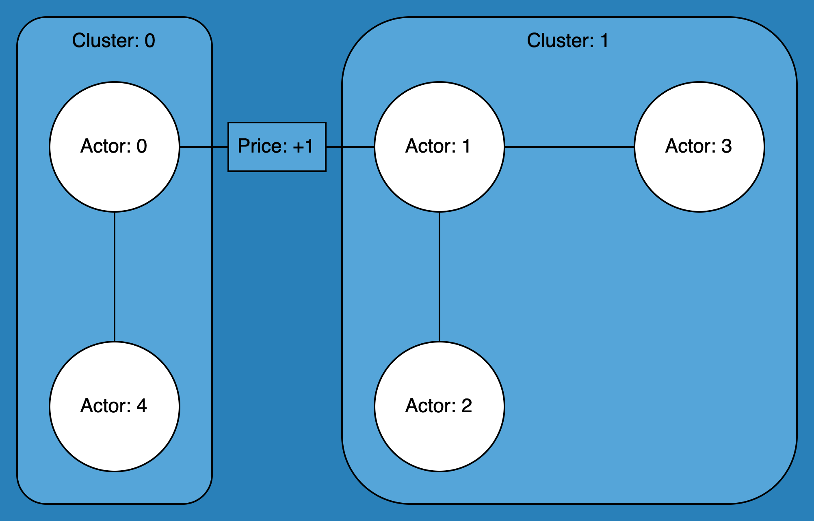

.. _matching_algorithms:

~~~~~~~~~~~~~~~~~~~
Matching Algorithms
~~~~~~~~~~~~~~~~~~~

The core of simply is the different matching algorithms. They decide which bids and asks are
matched together and at what price. Currently, simply has three matching algorithms: Pay-as-bid,
Two-Sided Pay-as-clear and BEST matching.

.. _example_scenario:

Example Scenario
================

The following example scenario is used to illustrate the functioning of the matching mechanisms
used across the simply matching algorithms. The scenario consists of a basic network of 5 actors
across 2 clusters. Actors 0 and 4 are in Cluster 0 and Actors 1, 2, and 3 are in Cluster 1. There
is a +1 grid-fee in-between the Cluster 0 and 1. Matches made between clusters, therefore, incur an
additional cost of +1.

Network
-------

   Figure 1: a basic network consisting of 5 actors across 2 clusters.

Grid-Free Matrix
----------------

Grid-fees are calculated for each order using the following grid fee matrix:

+--------------------+--------------------------+-------------------------+
|                    | Destination Cluster: 0   | Destination Cluster: 1  |
+====================+==========================+=========================+
| Origin Cluster: 0  | 0                        | 1                       |
+--------------------+--------------------------+-------------------------+
| Origin Cluster: 1  | 1                        | 0                       |
+--------------------+--------------------------+-------------------------+

Bids and Asks
---------------

Bids are placed by actors looking to buy energy and asks are placed by actors looking to sell
energy. For this example, using the network depicted above, 5 orders consisting of 3 bids and 2 asks are
added into the market.

**The Bids**

Two bids, i.e. type=-1, each for 0.1 energy have been placed by Actor 1 in Cluster 1, of which one
bid is set at the price of 10 and the other at the price of 7. The third bid is placed by Actor
0 in Cluster 0 and is for 0.1 energy at price 10.

**The Asks**

Both asks, i.e. type=1, added into the market are placed by Actor 3 in Cluster 1. Both are for 0.1
energy with one set at the price of 6 and the other at the price of 4.

The code below shows the syntax for inputting the bids and asks:

.. code:: python

    Order = namedtuple("Order", ("type", "time", "actor_id", "cluster", "energy", "price"))

    # Add bids
    m.accept_order(Order(-1, 0, 1, 1, 0.1, 10))
    m.accept_order(Order(-1, 0, 1, 1, 0.1, 7))
    m.accept_order(Order(-1, 0, 0, 0, 0.1, 10))

    # Add asks
    m.accept_order(Order(1, 0, 3, 1, 0.1, 6))
    m.accept_order(Order(1, 0, 3, 1, 0.1, 4))

Pay-as-Bid Algorithm
====================

Using the Pay-as-Bid algorithm (found here: :ref:`market`), buyers are able to place bids in the
market, alongside the asks placed by sellers. During each time slot, bids are sorted in descending
order and asks are sorted in ascending order. Each offer is then compared with each bid, if the
bid price is greater than the ask price, they are matched (partial matches of varying energy
quantities are allowed).

The table below illustrates the matching of the :ref:`example_scenario`:

**Final Matches (Output):**

+--------------------------------+-------------------------------+----------------+
| Bids                           | Asks                          | Matched Price  |
+================================+===============================+================+
| actor 0, order_id 2, price 10  | actor 3, order_id 4, price 4  | 10             |
+--------------------------------+-------------------------------+----------------+
| actor 1, order_id 0, price 10  | actor 3, order_id 3, price 6  | 10             |
+--------------------------------+-------------------------------+----------------+
| actor 1, order_id 1, price 7   |                               |                |
+--------------------------------+-------------------------------+----------------+

Two-sided Pay-as-Clear Algorithm
================================

Similarly to Pay-as-Bid, during each time slot, Two-sided Pay-as-Clear (found here: :ref:`2pac`)
sorts bids in descending order and asks in ascending order. After the matching has taken place at
this time slot, the highest matched ask price becomes the *clearing price* for all matched
orders of
this time slot.

The table below illustrates the matching of the :ref:`example_scenario`:

+--------------------------------+-------------------------------+----------------+
| Bids                           | Asks                          | Matched Price  |
+================================+===============================+================+
| actor 1, order_id 0, price 10  | actor 3, order_id 4, price 4  | 7              |
+--------------------------------+-------------------------------+----------------+
| actor 0, order_id 2, price 10  | actor 3, order_id 3, price 6  | 7              |
+--------------------------------+-------------------------------+----------------+
| actor 1, order_id 1, price 7   |                               |                |
+--------------------------------+-------------------------------+----------------+

BEST Matching Algorithm
=======================

BEST Matching (found here: :ref:`best`)

The tables below illustrate the internal steps during the matching of the :ref:`example_scenario`
using BEST matching:

**Matching Cluster 0 (Initial Attempt):**

+--------------------------------+-------------------------------+----------------+
| Bids                           | Asks                          | Matched Price  |
+================================+===============================+================+
| actor 0, order_id 2, price 10  | actor 3, order_id 4, price 5  | 5              |
+--------------------------------+-------------------------------+----------------+
|                                | actor 3, order_id 3, price 7  |                |
+--------------------------------+-------------------------------+----------------+

**Matching Cluster 1 (Initial Attempt):**

+--------------------------------+-------------------------------+----------------+
| Bids                           | Asks                          | Matched Price  |
+================================+===============================+================+
| actor 1, order_id 0, price 10  | actor 3, order_id 4, price 4  | 6              |
+--------------------------------+-------------------------------+----------------+
| actor 1, order_id 1, price 7   | actor 3, order_id 3, price 6  | 6              |
+--------------------------------+-------------------------------+----------------+

**Matching Cluster 0 (Rematch Attempt):**

+--------------------------------+-------------------------------+----------------+
| Bids                           | Asks                          | Matched Price  |
+================================+===============================+================+
| actor 0, order_id 2, price 10  | actor 3, order_id 3, price 7  | 7              |
+--------------------------------+-------------------------------+----------------+

**Matching Cluster 1 (Rematch Attempt):**

+--------------------------------+-------------------------------+----------------+
| Bids                           | Asks                          | Matched Price  |
+================================+===============================+================+
| actor 1, order_id 0, price 10  | actor 3, order_id 4, price 4  | 4              |
+--------------------------------+-------------------------------+----------------+
| actor 1, order_id 1, price 7   |                               |                |
+--------------------------------+-------------------------------+----------------+

**Final Matches (Output):**

+--------------------------------+-------------------------------+----------------+
| Bids                           | Asks                          | Matched Price  |
+================================+===============================+================+
| actor 0, order_id 2, price 10  | actor 3, order_id 3, price 7  | 7              |
+--------------------------------+-------------------------------+----------------+
| actor 1, order_id 0, price 10  | actor 3, order_id 4, price 4  | 4              |
+--------------------------------+-------------------------------+----------------+
