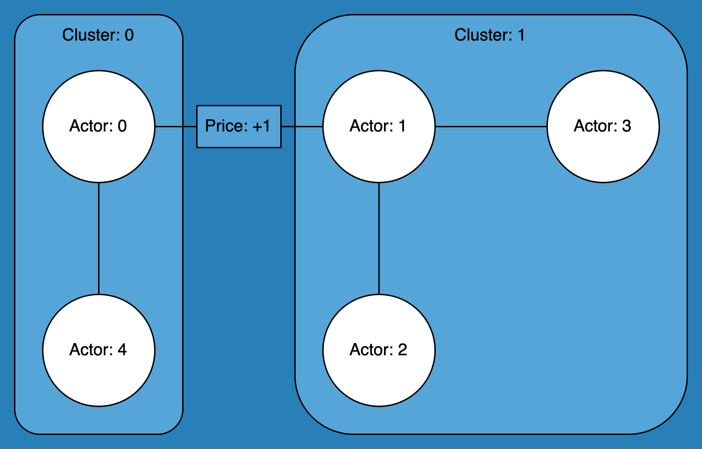

.. _matching_algorithms:

~~~~~~~~~~~~~~~~~~~
Matching Algorithms
~~~~~~~~~~~~~~~~~~~

The core of simply is the different matching algorithms. They decide which bids and asks are
matched together and at what price. Currently, simply has three matching algorithms: Pay-as-bid,
Two-Sided Pay-as-clear and BEST matching.

.. _example_scenario:

Example Scenario
================

The following example scenario is used to illustrate the functioning of the matching mechanisms
used across the simply matching algorithms. The scenario consists of a basic network of 5 actors
across 2 clusters. Actors 0 and 4 are in Cluster 0 and Actors 1, 2, and 3 are in Cluster 1. There
is a +1 grid-fee in-between the Cluster 0 and 1. Matches made between clusters, therefore, incur an
additional cost of +1.

Network
-------

   Figure 1: a basic network consisting of 5 actors across 2 clusters.

Grid-Free Matrix
----------------

Grid-fees are calculated for each order using the following grid fee matrix:

+--------------------+--------------------------+-------------------------+
|                    | Destination Cluster: 0   | Destination Cluster: 1  |
+====================+==========================+=========================+
| Origin Cluster: 0  | 0                        | 1                       |
+--------------------+--------------------------+-------------------------+
| Origin Cluster: 1  | 1                        | 0                       |
+--------------------+--------------------------+-------------------------+

.. _grid_fee_matrix:

Methods to Enter Grid Fee Matrix
--------------------------------

Entering a grid fee matrix into a simulation is essential for accurate cost calculations related to using the grid. Ensure proper format, identifiers, units, and values for the rate matrix, whether complete or created from config file entries.

There are two methods to define a grid fee matrix for the simply simulation:

1. :ref:`Providing a Complete Grid Fee Matrix`
2. :ref:`Building a Grid Fee Matrix from Configuration Files`

.. _Providing a Complete Grid Fee Matrix:

Providing an Already Complete Grid Fee Matrix
---------------------------------------------

**Format:**
The grid fee matrix should be provided in a structured format such as JSON or CSV.

**Placement:**
Place the complete grid fee matrix in the designated input location within the simulation environment, as specified in the simulation documentation or configuration settings.

Requirements
------------

**Names/Identifiers:**
Each row and column must be labeled with unique identifiers representing different clusters or nodes.

**Example Identifiers:**

- **Network Lines:** line_1, line_2, line_n
- **Nodes or Clusters:** node_A, node_B, node_C

**Units:**
Specify consistent units for both row and column headers to avoid confusion (e.g., USD, EUR).

**Weight Factor:**
The weight factor describes the relationship between grid fee and cumulative power network edge weight between two nodes in the network. The cumulative weight is the sum of all edge weights along the shortest path in the network between those nodes. If there are multiple nodes per cluster, nodes of one cluster have equivalent cumulative weights to all nodes of another cluster.

**Example JSON Grid Fee Matrix**

.. code-block:: json

   {
     "grid_fees": [
       {
         "name": "transmission_fee",
         "unit": "$/kWh",
         "value": 0.05
       },
       {
         "name": "distribution_fee",
         "unit": "$/kWh",
         "value": 0.03
       }
     ]
   }

.. _Building a Grid Fee Matrix from Configuration Files:

Building a Grid Fee Matrix from Config Files
--------------------------------------------

**Composition from Config Files**

The grid fee matrix can be composed by reading entries from configuration files using the following attributes:

- ``default_grid_fee``: Default grid fee applied for trades with the market maker
- ``local_grid_fee``: Local grid fee applied for trades within a cluster
- ``weight_factor``: Factor describing the relationship of grid fee to cumulative power network edge weights (see description above)

**Example Configuration Entries**

.. code-block:: python

   #--------------------------
   # market
   #--------------------------
   # default grid_fee to be used by market maker
   default_grid_fee = 0.09
   # local grid fee to be used
   local_grid_fee = 0
   # factor describing the relation of grid fee to cumulative power network edge weights
   weight_factor = 0.03

Bids and Asks
---------------

Bids are placed by actors looking to buy energy and asks are placed by actors looking to sell
energy. For this example, using the network depicted above, 5 orders consisting of 3 bids and 2 asks are
added into the market.

**The Bids**

Two bids, i.e. type=-1, each for 0.1 energy have been placed by Actor 1 in Cluster 1, of which one
bid is set at the price of 10 and the other at the price of 7. The third bid is placed by Actor
0 in Cluster 0 and is for 0.1 energy at price 10.

**The Asks**

Both asks, i.e. type=1, added into the market are placed by Actor 3 in Cluster 1. Both are for 0.1
energy with one set at the price of 6 and the other at the price of 4.

The code below shows the syntax for inputting the bids and asks:

.. code:: python

    Order = namedtuple("Order", ("type", "time", "actor_id", "cluster", "energy", "price"))

    # Add bids
    m.accept_order(Order(-1, 0, 1, 1, 0.1, 10))
    m.accept_order(Order(-1, 0, 1, 1, 0.1, 7))
    m.accept_order(Order(-1, 0, 0, 0, 0.1, 10))

    # Add asks
    m.accept_order(Order(1, 0, 3, 1, 0.1, 6))
    m.accept_order(Order(1, 0, 3, 1, 0.1, 4))

Pay-as-Bid Algorithm
====================

Using the Pay-as-Bid algorithm (found here: :ref:`market`), buyers are able to place bids in the
market, alongside the asks placed by sellers. During each time slot, bids are sorted in descending
order and asks are sorted in ascending order. Each offer is then compared with each bid, if the
bid price is greater than the ask price, they are matched (partial matches of varying energy
quantities are allowed).

The table below illustrates the matching of the :ref:`example_scenario`:

**Final Matches (Output):**

+--------------------------------+-------------------------------+----------------+
| Bids                           | Asks                          | Matched Price  |
+================================+===============================+================+
| actor 0, order_id 2, price 10  | actor 3, order_id 4, price 4  | 10             |
+--------------------------------+-------------------------------+----------------+
| actor 1, order_id 0, price 10  | actor 3, order_id 3, price 6  | 10             |
+--------------------------------+-------------------------------+----------------+
| actor 1, order_id 1, price 7   |                               |                |
+--------------------------------+-------------------------------+----------------+

Two-sided Pay-as-Clear Algorithm
================================

Similarly to Pay-as-Bid, during each time slot, Two-sided Pay-as-Clear (found here: :ref:`2pac`)
sorts bids in descending order and asks in ascending order. After the matching has taken place at
this time slot, the highest matched ask price becomes the *clearing price* for all matched
orders of this time slot. As one single clearing prices is identified, varying grid fees
cannot be incorporated. Instead the default grid fee or a numeric grid fee matrix is used. 

The table below illustrates the matching of the :ref:`example_scenario` with grid fee matrix of 1:

+--------------------------------+-------------------------------+----------------+
| Bids                           | Asks                          | Matched Price  |
+================================+===============================+================+
| actor 1, order_id 0, price 10  | actor 3, order_id 4, price 4  | 7              |
+--------------------------------+-------------------------------+----------------+
| actor 0, order_id 2, price 10  | actor 3, order_id 3, price 6  | 7              |
+--------------------------------+-------------------------------+----------------+
| actor 1, order_id 1, price 7   |                               |                |
+--------------------------------+-------------------------------+----------------+

BEST Matching Algorithm
=======================

BEST Matching (found here: :ref:`best`)

The BEST matching algorithm takes the network charge into account. In a first step, all clusters 
are matched individually. (A cluster contains all nodes between which a network charge of 0 is defined). 
For this purpose, the bids from the dedicated cluster and the asks from all clusters are considered. 
If an ask is matched in more than one cluster, the match is only kept in the cluster where the network 
charge is the lowest. The match is deleted from the other clusters. The clusters with deleted matches 
are then subjected to a new matching procedure. This procedure continues until no more duplicate matches occur. 

The tables below illustrate the internal steps during the matching of the :ref:`example_scenario`
using BEST matching:

**Matching Cluster 0 (Initial Attempt):**

+--------------------------------+-------------------------------+----------------+
| Bids                           | Asks                          | Matched Price  |
+================================+===============================+================+
| actor 0, order_id 2, price 10  | actor 3, order_id 4, price 5  | 5              |
+--------------------------------+-------------------------------+----------------+
|                                | actor 3, order_id 3, price 7  |                |
+--------------------------------+-------------------------------+----------------+

**Matching Cluster 1 (Initial Attempt):**

+--------------------------------+-------------------------------+----------------+
| Bids                           | Asks                          | Matched Price  |
+================================+===============================+================+
| actor 1, order_id 0, price 10  | actor 3, order_id 4, price 4  | 6              |
+--------------------------------+-------------------------------+----------------+
| actor 1, order_id 1, price 7   | actor 3, order_id 3, price 6  | 6              |
+--------------------------------+-------------------------------+----------------+

**Matching Cluster 0 (Rematch Attempt):**

+--------------------------------+-------------------------------+----------------+
| Bids                           | Asks                          | Matched Price  |
+================================+===============================+================+
| actor 0, order_id 2, price 10  | actor 3, order_id 3, price 7  | 7              |
+--------------------------------+-------------------------------+----------------+

**Matching Cluster 0 (Rematch Attempt):**

+--------------------------------+-------------------------------+----------------+
| Bids                           | Asks                          | Matched Price  |
+================================+===============================+================+
| actor 0, order_id 2, price 10  |                               |                |
+--------------------------------+-------------------------------+----------------+

**Final Matches (Output):**

+--------------------------------+-------------------------------+----------------+
| Bids                           | Asks                          | Matched Price  |
+================================+===============================+================+
| actor 1, order_id 0, price 10  | actor 3, order_id 4, price 4  | 6              |
+--------------------------------+-------------------------------+----------------+
| actor 1, order_id 1, price 7   | actor 3, order_id 3, price 6  | 6              |
+--------------------------------+-------------------------------+----------------+
