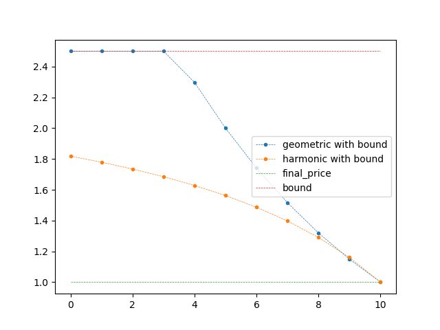

.. _pricing_strategies:

~~~~~~~~~~~~~~~~~~~
Pricing Strategies
~~~~~~~~~~~~~~~~~~~

Simply implements several options to simulate specific interactions of actors in the market. Basic strategies can be used
to give each actor a base line strategy which follows from the knowledge of future market maker prices and
the agents own schedule, i.e. expected residual load. This does not take the possibility of local interaction between actors into account. This is
where static pricing strategies can be used. Static pricing strategies are based on the market_schedule, which defines
amounts of energies which have to be traded at current or future times. They arise from the schedule, the chosen strategy
and the constraint that the energy schedule has to be met through trades or energy inside of the actors battery. When a
time step is reached where the market_schedule has an energy value, an order is generated with the market_maker price in order to fulfill the scheduling constraints with energy from the market maker.

The pricing strategy regards planned orders in future time steps through the market_schedule. The pricing strategy works by analyzing this market_schedule. The next upcoming order is generated early with an adjusted, more favorable price for the actor. With fewer time steps in between the mandatory market maker interaction and the current time step, the price converges towards the market maker price. If some local market actor fulfills the order, the market schedule gets adjusted. If no matching with local actors is achieved, the actor will trade with the market maker at the planned time step with the market maker price to guarantee order fulfillment.
Order amounts are adjusted to respect soc boundaries in between the current time step and the planned market_schedule time step.

An example scenario could be.
    - The actor needs 10 energy in 5 time steps to fulfill his schedule
    - The market maker has the lowest price of 0.5 currency units in 3 time steps
    - Due to the actor strategy the actor plans to buy 10 energy from the market maker in 3 time steps
        - The market_schedule will have 10 as a value at index 3
    - The actor generates an order at the current time step for a lower price than 0.5 currency units, e.g. 0.25
    - The market maker will not match this order, but local prosumers might sell for this price, which is lower than the market maker price
        - If the order gets matched the market_schedule will deduct the matched energy at index 3
        - If the order does not get matched the price for order generation will be increased in the next time step, e.g. 0.35
    - If no matching takes place up until index 3, the order generation will use the final price of 0.5 currency units to guarantee matching with the market_maker

Pricing can be custom function with the arguments steps (int), final_price (float) and energy(float)

- steps the amount of time steps until interaction with the market_maker is planned
- final price is the guaranteed market maker price
- energy is the energy amount of the planned interaction, mostly used to determine the direction of the order. Positive energy amounts mean buying power and vice versa.

Besides the custom function, 3 different pricing strategies are implemented in form of a dictionary. The dictionary has two keys "name" and "params". The name describes the functions and params defines the function parameters. The pricing strategies are described shortly below.

.. _linear_pricing:

Linear Pricing
================
The linear pricing strategy uses a linear function to calculate the price of the current order generation.

.. math::

    current\textunderscore price = final\textunderscore price - sign(energy) * steps * m

Since positive energy values mean the actor wants to buy energy, the current price will be lowered to smaller values. To make use of this pricing strategy a dictionary has to be passed to the actor like in the code below:

.. code:: python

   delta_per_time_step = some_float_value
   actor.pricing_strategy = dict(name="linear", param=[delta_per_time_step])

The sign of delta_per_time_step is discarded so that prices are always lowered when the actor buys energy and increased when the actor wants to sell energy.

Harmonic Pricing
================
Harmonic pricing changes the price according to the reversed harmonic series meaning prices will follow scale like:

.. math:: ... \frac{1}{5}, \frac{1}{4}, \frac{1}{3}, \frac{1}{2}, 1

Selling prices are calculated as reciprocal values, e.g.:

.. math:: ... 5, 4, 3, 2, 1

The mandatory parameter is the half life index, which defines at which index half of the final price is reached. To use this strategy a dictionary has to be defined as follows:

.. code:: python

   half_life_index = some_float_value
   symmetric_bound_factor = some_other_value
   actor.pricing_strategy = dict(name="harmonic", param=[half_life_index,symmetric_bound_factor])

With the *symmetric_bound_factor* (being optional) and half_life_steps always being positive values, the formulas used are:

.. math::

    \mathrm{factor} &= (\frac{\mathrm{steps}}{\mathrm{half\textunderscore life\textunderscore steps}} + 1)^{-1} \\
    \mathrm{delta\textunderscore price} &= (1 - \mathrm{symmetric\textunderscore bound\textunderscore factor}) * \mathrm{final\textunderscore price}\\
    \mathrm{buy\textunderscore price} &= (\mathrm{delta\textunderscore price} * \mathrm{factor} + (\mathrm{final\textunderscore price} - \mathrm{delta\textunderscore price})\\
    \mathrm{current\textunderscore price} &= (\mathrm{buy\textunderscore price} / \mathrm{final\textunderscore price}) ^{sign(\mathrm{energy})} * \mathrm{final\textunderscore price}\\

The second parameter *symmetric_bound_factor* describes the convergence price of the  current price. Therefore a *symmetric_bound_factor* of 0.5 means prices will not go below 50% of the final price, no matter how far in the future the planned market interaction is. In these cases the harmonic pricing is symmetric, meaning that in the case of selling the price will not go beyond 200% of the final price. The form of the function is mirrored in this case, e.g. *symmetric_bound_factor* of 50% and half life index of 1 will lead to:

.. math::

    ... 0.625, 0.66, 0.75, 1

.. math::

    ... 1.375, 1.33, 1.25, 1

Geometric Pricing
===================

Geometric pricing uses a geometric series to scale the price and follows the function

.. math::

     current\textunderscore price = final\textunderscore price * (geometric\textunderscore factor^{sign(energy)})^{steps}

where the geometric factor is always smaller than 1. The *symmetric_bound_factor* is optional

.. code:: python

   geometric_factor = some_positive_float_value
   symmetric_bound_factor = some_other_value
   actor.pricing_strategy = dict(name="geometric", param=[half_life_index,symmetric_bound_factor])

The *symmetric_bound_factor* clips value to this bound, i.e. if resulting prices exceed this final_price multiplier, they are clipped to this value. I.e. if the *symmetric_bound_factor* is 2, the final_price can not exceed twice the final_price or go below 1/2 of the final_price in case of selling energy.

Comparison of Pricing Strategies
================================
To show the different behaviour of these pricing strategies the following figure, shows the resulting price, for some order which is planned in the market_schedule in 10 time_steps and has a final price of 1. The bound factor is set to 0.4 in the cases with bounds.

   Figure 1: scaling of buy prices up to the order price of the market maker.

   Figure 2: scaling of sell prices up to the order price of the market maker.

   Figure 3: scaling of buy prices up to the order price of the market maker with a boundary argument.

   Figure 4: scaling of sell prices up to the order price of the market maker with a boundary argument.